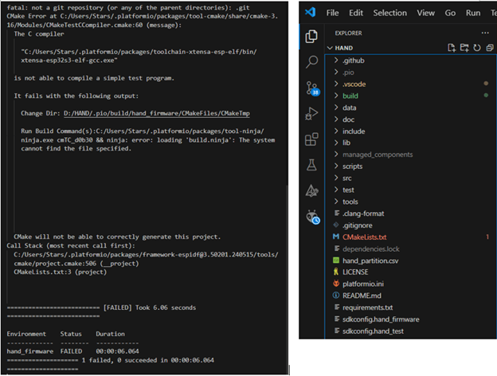

# HAND: A Wearable Embedded ETA Subsystem

## Repository Overview

This repository contains the firmware for the ESP32-S3 on the HAND main board and a Python server that receives protocol buffers, along with documentation. Other related repositories are listed in the table below:

| Repo Name                                                         | Description                                                                                                                  |
|:------------------------------------------------------------------|:-----------------------------------------------------------------------------------------------------------------------------|
| [hand_pcb](https://github.com/Dennis40816/hand_pcb)               | Contains the PCB files used in HAND.                                                                                         |
| [hand_simulation](https://github.com/Dennis40816/hand_simulation) | Contains the simulation files for HAND PDN in ORCAD.                                                                         |
| [hand_app](https://github.com/Dennis40816/hand_app)               | Receives ESP-IDF debug messages from the HAND main board via UDP communication. Future updates plan to integrate protocol buffers and UI, developed using Flutter. |

## About

### What Is HAND?

Haptic Assistance Navigation Device (HAND), as one of the subsystems of an Electronic Travel Aid (ETA), primarily provides basic vibration feedback to assist visually impaired or mobility-challenged individuals in detecting obstacles ahead. HAND integrates ultrasonic and infrared sensing technologies to detect obstacles in the user's path and surrounding environment, and employs piezoelectric vibration motors to generate vibration signals that convey environmental information through tactile means. The device features a wearable design, coupled with an ESP32-S3-MINI microcontroller (equipped with a PCB antenna), enabling real-time data acquisition and transmission, and allowing for data exchange with other assistive devices.

In addition, HAND's hardware architecture is meticulously designed, including the configuration of the power delivery network (PDN), which ensures stable system operation during USB power switching and charging. Its software system is built on a real-time operating system (RTOS) to manage sensor data collection and vibration signal output, ensuring that all functions operate according to schedule. These design features make HAND a subsystem within the ETA that provides basic vibration feedback, assisting users in acquiring environmental information and thereby potentially enhancing safety and independence during movement.

### What Is ETA?

ETA, which stands for Electronic Travel Aid, is an assistive device specifically designed for visually impaired and mobility-challenged individuals. It employs various sensing technologies such as ultrasonic, infrared, or radar sensors to detect obstacles in the user’s path and surroundings, thereby providing safe mobility assistance. The primary purpose of this device is to help users become aware of environmental changes in real time during movement, reducing the risk of collisions or falls.

Functionally, the ETA can automatically detect obstacles along the path and alert the user through auditory signals, vibrations, or other feedback mechanisms to take evasive action. Moreover, some advanced ETA models are integrated with GPS or mapping functions, offering real-time navigation and route planning to assist users in finding the best path in complex or unfamiliar environments. This combination of multiple technologies enables the ETA to be effective in both indoor and outdoor settings.

In terms of its purpose, the core objective of the ETA is to enhance the user's independence and safety. Through precise sensing and real-time feedback, visually impaired or mobility-challenged individuals can rely less on external assistance, thereby gaining more confidence and freedom in their daily lives. At the same time, it helps alleviate the burden on caregivers and promotes a broader societal awareness and improvement of accessible environments.

## Appearance

|              | Front                                     | Back                                                     |
|:------------:| ----------------------------------------- | -------------------------------------------------------- |
|  Main Board  |      |      |
| Sensor Board |  |  |

The combination of the main board and the sensor board is shown below:


It is worn on the user's hand back as shown below:


## Directory Description

- **doc**  
  Contains documentation and other related experimental files.
  - **data**  
    Contains sample data formats returned by HAND firmware, along with their descriptions.
  - **part_test**  
    Contains files and video records for testing selected ICs (e.g., [CH101](https://github.com/Dennis40816/HAND/tree/port_ch101/doc/part_test/port_ch101)) before HAND production.

    

- **include**  
  Contains HAND firmware configuration header files.

- **lib**  
  Contains driver libraries for the ICs used in HAND:
  - BOS1901
  - VL53L1X
  - CH101
  - TCA6408A

- **scripts**  
  Contains hook scripts for PlatformIO or data processing scripts.

- **src**  
  Contains HAND ESP-IDF code, divided into modules by functionality:
  - **espidf_framework_test**  
    Contains test programs for ESP-IDF (including FreeRTOS).
  - **hand_modules**  
    Contains all modules as HAND is designed in a modular manner.
  - **hand_test**  
    This project is in the early stages of HAND, mainly for testing the proper functioning of ICs and sensor features. Note: Each file in hand_test contains an `app_main` function, so having more than one `.c` file in the same directory will cause compilation errors.
    - **device_related**  
      - *group_test* : Integrates tests for multiple ICs, currently including VL53L1X group, CH101 group, and a combined test of VL53L1X and CH101.
      - *id_test* : Each IC has a basic operational test (e.g., reading the `whoami` register), and all basic tests are placed here.  

        > Note: When testing BQ27427, ensure that the battery is connected.

        

    - **hand_module_related**  
      Used for testing modules within hand_modules.

- **test**  
  Contains independently executable programs. Running the following command:

  ```bash
  pio test -v
  ```

  will execute all tests, or a specific target can be set in `platformio.ini`.

## Environment Requirement

### Hardware

- [Battery 3000 mAh, 1C (custom)](https://pse.is/7cx6h8)
- USB-C cable
- [WITRN U3 USB meter (optional)](https://www.witrn.com/?p=92)
- [DSLogic Logic Analyzer Personal Edition Pro (optional)](https://pse.is/7cx76a)

### OS

- Windows 11

### PlatformIO

HAND firmware project is configured and managed using PlatformIO (e.g., ESP-IDF configuration). PlatformIO uses Scons to manage the build process and allows adding an `extra_script.py` in the library for specific process management.

> [!WARNING]
> The `platformio.ini` file will only trigger project configuration after it is modified and saved. If changes do not take effect, try adding a random character, saving, then deleting it and saving again to force the configuration.

#### Install

> [!NOTE]
> ESP-IDF will be downloaded by PlatformIO to `$env:HOME/.platformio/packages/framework-espidf`.

Please install the PlatformIO plugin in VSCode.


### Python Virtual Environment

In HAND, the Python server that receives Wi-Fi data from the firmware and the conversion process from `.proto` to `.[ch]` files are handled by Python. To avoid conflicts with the existing environment, create an isolated Python virtual environment using tools such as conda, uv, or virtualenv. Below are the package installation requirements.

#### TCP Proto Server

| Package  | Version |          Installation          |
|:--------:|:-------:|:------------------------------:|
| protobuf | 5.27.3  | `pip install protobuf==5.27.3` |

#### Scons

For scripts run by Scons (e.g., `hand_hook.py`), install the required Python packages in PlatformIO's Python environment:

```bash
$env:HOME\.platformio\penv\Scripts\python.exe
# e.g.,
C:\Users\USER\.platformio\penv\Scripts\python.exe
```

Activate the environment via PowerShell:

```bash
$env:HOME\.platformio\penv\Scripts\Activate.ps1
```

Then install the packages using:

```bash
pip install <packages>
```

|  Package  | Version |      Installation       |
|:---------:|:-------:|:-----------------------:|
| termcolor |    -    | `pip install termcolor` |

#### src_filter

Place an `extra_script.py` in the lib folder to modify PlatformIO's `src_filter`.

### Nanopb & ProtoBuf

> [!NOTE]
> Nanopb will be installed automatically by PlatformIO because the dependency of Nanopb is already written in platformio.ini.

Nanopb is a lightweight C implementation of Google's Protocol Buffers, tailored for embedded systems. It minimizes memory usage and code size, making it ideal for microcontrollers where the full ProtoBuf library would be too heavy.

#### For Nanopb and C output

```bash
# make sure you are in the root of the project

# try to build once (will fail)

# open PlatformIO CLI

# generate by nanopb_generator.py
python .pio/libdeps/hand_firmware/Nanopb/generator/nanopb_generator.py src/hand_modules/hand_data/proto/hand_data.proto
```

#### For protobuf and Python output

- Ensure that [protoc](https://github.com/protocolbuffers/protobuf/releases) is installed and available in your terminal.
- Also, make sure you already installed the `protobuf` package in Python.
- `protoc` and the Python `protobuf` package are interdependent. Assuming that the author uses `protobuf` version 5.27.3, the corresponding `protoc` version would be [protoc v27.3](https://github.com/protocolbuffers/protobuf/releases/tag/v27.3).

- Compile the protobuf:

```bash
# make sure you are in the root of the project

# open PlatformIO CLI

protoc -I=src/hand_modules/hand_data/proto --python_out=tools/tcp_server src/hand_modules/hand_data/proto/hand_data.proto
```

If you want to generate code for Flutter, simply replace `--python_out` with `--dart_out`.

### Others

- [clang format (optional)](https://releases.llvm.org/download.html)

## Build Tutorial

Once PlatformIO is set up, please run a build once to allow PlatformIO to download the necessary packages. Click on hand firmware ➞ General ➞ Build as shown below:


### Firmware

[Watch on YouTube]()

### Protocol Buffer

You should ensure that the ProtoBuf library versions are consistent across all protocol buffer endpoints. On the MCU side, Nanopb is used to generate the `.[ch]` files, but this process still depends on the Python `protobuf` package. On the server side, `.proto` files are compiled to `.py` files using `protoc`, and the Python `protobuf` package is used to process protocol buffer data on the server. Therefore, the versions of `protoc` and the Python `protobuf` package should be aligned, while Nanopb only requires version ≥ 0.4.8.

We assume the Python package `protobuf` already installed in your Python virtual environment.

- For MCU

  ```bash
  ## enter correct python venv, for example:
  conda activate hand

  ## make sure the directory ".pio/libdeps/hand_firmware/Nanopb" already existed 

  python .pio/libdeps/hand_firmware/Nanopb/generator/nanopb_generator.py src/hand_modules/hand_data/proto/hand_data.proto
  ```

  

- For Server

  ```bash
  ## enter correct python venv, for example:
  conda activate hand

  ## check protoc version
  protoc --version
  # e.g., libprotoc 27.3
  # e.g., libprotoc 30.2

  ## install python protobuf package
  # for libprotoc 27.3
  pip install protobuf==5.27.3
  # for libprotoc 30.2
  pip install protobuf==6.30.2

  ## generate python file
  protoc -I=src/hand_modules/hand_data/proto --python_out=tools/tcp_server src/hand_modules/hand_data/proto/hand_data.proto
  ```

### Utils

> How to get build logs?

In powershell, do the following commands

  ```ps1
  pio run -e hand_firmware -vv 2>&1 | Tee-Object -FilePath <log-name>
  ```

## Demo

## Experiments

### Static Distance Test

#### Method

We fixed the HAND on a plane and elevated it, using another plane as the target object, and measured the distance between them.


#### Result

For both sensors, the static results showed linearity nearly equal to 1, indicating that the integrated sensors can operate stably. It is noteworthy that the CH101 also receives reflections from the ground, so the angle relative to the ground should be taken into consideration.

**VL53L1X**


**CH101**


### CH101 Beam Pattern

#### Method

The HAND was fixed on the XPC3 rotating platform for a 180-degree rotation. An iron plate was placed in front of it, putting the CH101 into a simultaneous transmission and reception mode, thereby obtaining the relationship between the angle and the echo intensity.


> [!NOTE]  
> The CH101 requires an additional shield on the IC to increase the length of its transmitting neck, preventing the signal from being ineffective. Related shield designs are provided on the [CH101 official website](https://invensense.tdk.com/products/ch101/).


#### Result

By defining the visible range as the half-energy point (-6 dB), the visible range of the CH101 on the HAND was determined to be approximately 67 degrees in total:


### Power Consumption

#### Hardware

- WITRN U3 USB Current Meter

    

#### Method

The PC software for the U3 can obtain current and voltage data sampled at 100 Hz. Since it is powered via USB, the voltage is fixed (approximately 5.1 V). Measurements are taken under the following conditions:

- Main board only, idle state
- Main board + sensor board, idle state
- Main board + sensor board, performing measurement and Wi-Fi transmission

#### Result


From the time-current graph, it can be observed that the idle current averages approximately 26 mA when only the main board is present, and increases to 33 mA with the addition of the sensor board. Under actual operational conditions, both measurement and Wi-Fi transmission contribute to an increase in current consumption. The peaks observed in the graph correspond to transient current surges during Wi-Fi transmission, reaching up to 200 mA, while the **average current consumption is approximately 86 mA**.

Based on the battery specifications of the HAND system (3000 mAh, 11.1 Wh), the entire system can remain in standby mode for approximately **66** hours. Under normal operating conditions, the system can operate continuously for around **25.81** hours.

### HAND Power Delivery Network (PDN) Simulation

#### Method

See [hand_simulation](https://github.com/Dennis40816/hand_simulation) for more details.

#### Result

The PDN function operates as expected, reliably providing 5V and 3.3V outputs under a 1A load, and maintains normal performance during both USB plug and unplug events.


## Contribution

- porting drivers
  - porting CH101 to ESP-IDF
  - porting VL53L1X to ESP-IDF
- develop drivers
  - TCA6408A
  - BOS1901
- design a chargable embbded system
- get HAND basic hardware characteristic and proof it works
- integrate sensor on **Flexible PCB**

## Trouble Shooting

### PlatformIO

1. **Issue Description:**  
   A CMake warning appears indicating that the tool version cannot be retrieved. The error message is as follows:  

   ```bash
   CMake Warning at C:/Users/user/.platformio/packages/framework-espidf/tools/cmake/tool_version_check.cmake:41(message):
   Can not get version for tool:
   C:/Users/user/.platformio/packages/toolchain-xtensa-esp32s3/bin/xtensa-esp32s3-elf-gcc.exe
   ```

   **Solution:**  
   Delete the `.git/` folder in `C:/Users/<your-user>/` and rebuild the project.

   

2. **Issue Description:**  
   VSCode has generated a new `build` folder in the root directory of the project, which leads to a build failure.

   

   **Solution:**  
   In the VSCode `settings.json` file, change the setting `"cmake.configureOnOpen"` to `false`. Then, delete the `build` folder and rebuild the project. Alternatively, disable the CMake extension directly.
3. **Issue Description:**
   During the first flash, the ESP32S3 is in its default mode (USB CDC) and must be switched to USB Serial JTAG mode for proper console printing, flashing, and debugging.

   **Solution:**
   - Press and hold **BOOT (IO0)** for at least 100 ms.  
   - Then press and hold **RESET (RST/EN)** for at least 100 ms.  
   - Release **RESET** first, then release **BOOT**.
   - Check PIO using `esptool`.

     

   - If issues persist, delete the `.pio` folder and rebuild the project.

4. [CMake Error: grabRef.cmake no file head-ref](https://community.platformio.org/t/cmake-error-grabref-cmake-no-file-head-ref/28119)

## Developer Notes

### Writing `extra_script.py` in the Library

- Ensure that all required files (including `.c` files) have their parent directories included in the build process. You can either add the necessary `-I` flags in `library.json` or use `env.Append(CPPPATH=[absolute_path])` in `extra_script.py`.
- For dynamic adjustments (e.g., modifications through the `platformio.ini` file), implement logic in `extra_script.py` to adapt build flags accordingly.
- **My Thoughts (based on PlatformIO):**  
  In my experience with PlatformIO, a well-organized `extra_script.py` can significantly reduce debugging time related to include path issues. It not only streamlines conditional compilation but also ensures that libraries remain modular and maintainable, especially when supporting multiple platforms with different include requirements.

### Updating Include Paths

- Include path updates rely on two factors:
  1. Modifications in `extra_script.py` (which require a rebuild for changes to take effect).
  2. Changes in `library.json`, `CMakeLists.txt`, or `platformio.ini` that modify build flags with `-I`. These may not be recognized until PlatformIO detects the change. A simple method to force an update is to add and then remove a character in the file.
- **My Thoughts (based on PlatformIO):**  
  PlatformIO can be quite aggressive in caching build configurations. Occasionally, a manual clean or rebuild is necessary to ensure that new include paths are properly integrated. Using the IDE's "Clean" function can help alleviate such issues.

### Observations

- Directly including a header file can override existing definitions, whereas including it indirectly (through another file) might not yield the expected overrides.  
- This emphasizes the importance of maintaining a clear and consistent include hierarchy and managing dependencies explicitly.

## Alias Name List

- **PPB:** Ping Pong Buffer  
- **SS:** Stack Size (for FreeRTOS task size)  
- **HAND:** Haptic Assistance Navigation Device

## TODO

**firmware**

- porting KX132-1211 driver
- porting BQ27427 driver
- fix bugs in BOS1901 driver
- build proto related file before build procedure

**app**

- add realtime plot
- add control panel
