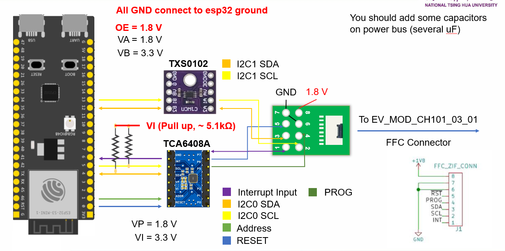

# CH-101 on ESP32-S3-MINI

## Software requirements

- Visual Studio Code
- Platform IO (VSCode extension)

## Board and platform

- board: esp32-s3-devkitm-1
- platform: espressif32
- framework: esp-idf

## Hardware requirements

- **ESP32-S3-DevKitM-1**

    The ESP32-S3-DevKitM-1 is a development board from Espressif Systems, designed to facilitate the rapid prototyping and development of IoT (Internet of Things) applications. It is built around the ESP32-S3, a powerful microcontroller that features dual-core processing, Wi-Fi and Bluetooth capabilities, and a wide range of peripherals. This board is particularly noted for its support for AI-based applications such as voice recognition and signal processing, making it suitable for smart home devices, wearable electronics, and various other innovative IoT solutions.

- **TCA6408A**
    The TCA6408A is a low-voltage 8-bit I2C General Purpose Input/Output (GPIO) expander designed by Texas Instruments. It's primarily used to increase the number of GPIO pins available in a microcontroller or microprocessor-based system. Each of the eight I/O pins can be independently configured as an input or output, allowing for versatile expansion capabilities. This device is particularly useful in applications where additional GPIOs are required but are not available or are limited on the main processor.
    \
    It's a self-designed dev board. The design documents can be found in directory  

    **[pcb_files/TCA6408A](pcb_files/TCA6408A/)**.  

- **TXS0102**

    The TXS0102 is a 2-bit bidirectional voltage-level translator from Texas Instruments, designed for open-drain and push-pull applications. It's used to facilitate communication between devices operating at different voltage levels, supporting voltage translation between 1.65 V and 5.5 V. This makes the TXS0102 ideal for multi-voltage digital system applications, such as interfacing between low-voltage microcontrollers and higher voltage components within a system.

- **FTL232RL or power supply (provide 1.8 V for CH-101)**

    The FT232RL is a USB to serial UART interface IC device which supports a range of baud rates and configurations for serial communication. It is commonly used for bridging USB connections to serial ports and is noted for its easy implementation and reliability. When referred to in the context of providing 1.8 V for CH-101, it might be a mix-up with a different component or an external power supply requirement. The CH-101 sensor requires a 1.8 V power supply, which suggests that either a specific power supply unit or another component (potentially a voltage regulator) is needed to ensure the correct operating voltage.

- **EV_MOD_CH101_03_01**

    The EV_MOD_CH101_03_01 appears to be a model number for an evaluation module, likely related to the CH-101 ultrasonic sensor from Chirp Microsystems. This module is designed for the rapid development and testing of the CH-101 sensor, which is capable of precise distance measurement using ultrasonic waves. Evaluation modules like this are typically used for prototyping and feasibility studies in various applications, including robotics, user presence detection, and object ranging.

- **FFC 8 pin 0.5 mm converter board**

    An FFC (Flexible Flat Cable) 8 pin 0.5 mm Converter Board is an adapter used to convert the fine pitch of an FFC (typically found in compact electronic assemblies) to a more standard and manageable connection interface. This type of converter board is essential when integrating components that use very thin and flexible cables, allowing for easier connection to larger or more standard prototyping boards and equipment. It is particularly useful in designs requiring compactness and flexibility, such as wearable electronics or tight space constraints.

## Test Code

- use branch `port_ch101`
- github tag: [part_test_ch101_v1.1](https://github.com/Dennis40816/HAND/releases/tag/part_test_ch101_v1.1
)

## How do I view the TCA6408A src files?

- We use [JLC EDA](https://pro.easyeda.com/editor) to design TCA6408A module. Therefore, you can login it by google and import the jlceda pro file to view it.

## Wiring

- See [wiring.pdf](wiring/wiring.pdf) for details.

## Demo video

- We use short range narrow driver code to init CH-101 (`ch101_gpr_sr_narrow_init`).
- The max distance is set to 500 mm.

- If the video doesn't show, please go to [demo_video](demo_video/) to see it.

